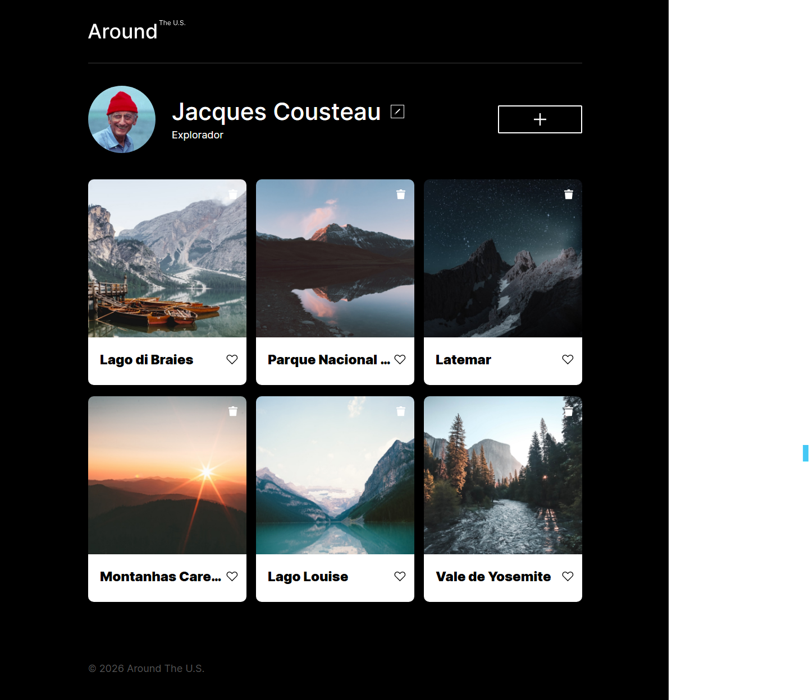

# Around The U.S.

Aplicação web interativa para compartilhamento de fotos desenvolvida com **HTML, CSS e JavaScript (Vanilla JS)**.

O projeto evolui de uma página estática para uma aplicação estruturada utilizando **arquitetura modular e programação orientada a objetos**.

## Demo

🌐 **[Ver Demo Online](https://flpzht.github.io/web_project_around_pt/)**

## Visão Geral

O projeto começou como uma página totalmente estática e evoluiu gradualmente para uma aplicação dinâmica. Ao longo do desenvolvimento foram implementados conceitos essenciais de front-end moderno, incluindo manipulação avançada do DOM, reutilização de componentes e organização do código em módulos independentes.

A aplicação permite visualizar, adicionar, curtir e excluir cartões de fotos, além de editar informações do perfil do usuário.



## Funcionalidades Implementadas

* Renderização dinâmica de cartões a partir de um array de objetos
* Criação de novos cartões via formulário em popup
* Inserção de novos cartões no topo da lista
* Exclusão de cartões diretamente do DOM
* Sistema de curtidas com alternância de estado visual
* Visualização ampliada de imagens em popup com legenda dinâmica
* Edição das informações de perfil do usuário
* Validação de formulários em tempo real
* Reset automático de formulários ao abrir popups
* Arquitetura JavaScript modular com classes reutilizáveis

## Tecnologias e Conceitos

| Tecnologia / Conceito           | Aplicação no Projeto                                                  |
| ------------------------------- | --------------------------------------------------------------------- |
| HTML5 Semântico                 | Estrutura da página com `<header>`, `<main>`, `<section>`, `<footer>` |
| CSS3 + BEM                      | Estilização modular utilizando Block, Element, Modifier               |
| JavaScript ES6+                 | Classes, módulos ES6, manipulação do DOM, eventos                     |
| Programação Orientada a Objetos | Componentização da lógica em classes reutilizáveis                    |
| ES Modules                      | Separação de responsabilidades usando `import` e `export`             |
| Validação de Formulários        | Validação nativa do navegador com mensagens customizadas              |
| Template HTML                   | Base para geração dinâmica de cartões                                 |

## Metodologia BEM

O projeto utiliza a metodologia **BEM (Block, Element, Modifier)** para organização dos estilos CSS.

Exemplos de nomenclatura:

```
.card
.card__image
.card__like-button_is-active
.popup_is-opened
```

Os estilos são organizados em arquivos separados dentro da pasta `blocks/`, e todos são importados pelo arquivo central `pages/index.css`.

Essa abordagem melhora a manutenção, evita conflitos de estilos e facilita a escalabilidade do projeto.

## Arquitetura da Aplicação

A aplicação segue uma arquitetura modular baseada em **Programação Orientada a Objetos**, onde cada responsabilidade da interface é encapsulada em uma classe específica.

### Fluxo de funcionamento

index.js (entry point)
↓
Instancia os componentes principais
↓
Section renderiza os cartões
↓
Card controla eventos do cartão
↓
Popup gerencia modais
↓
PopupWithForms lida com submissão de formulários
↓
FormValidator controla validação dos inputs
↓
UserInfo gerencia dados do perfil

### Principais Componentes

**Card**

Responsável pela criação de cartões de imagem.
Gerencia estrutura do cartão, eventos de curtida, exclusão e clique para visualização da imagem.

**Section**

Gerencia a renderização de múltiplos cartões na página.
Recebe um renderer que define como cada cartão deve ser criado e inserido no container.

**Popup**

Classe base responsável por controlar o comportamento geral dos popups (abrir, fechar e gerenciamento de eventos).

**PopupWithForms**

Extende `Popup` para trabalhar especificamente com formulários.
Captura dados do formulário e executa a função de callback no envio.

**PopupWithImage**

Extende `Popup` para exibir imagens ampliadas com legenda dinâmica.

**FormValidator**

Gerencia a validação dos formulários em tempo real, exibindo mensagens de erro e controlando o estado do botão de envio.

**UserInfo**

Responsável por gerenciar e atualizar as informações exibidas no perfil do usuário.

## Estrutura de Pastas

```
web_project_around_pt/
├── blocks/
│   ├── card.css
│   ├── cards.css
│   ├── content.css
│   ├── footer.css
│   ├── header.css
│   ├── page.css
│   ├── popup.css
│   └── profile.css
│
├── images/
│   ├── add-icon.svg
│   ├── avatar.jpg
│   ├── close.svg
│   ├── delete-icon.svg
│   ├── edit-icon.svg
│   ├── like-active.svg
│   ├── like-inactive.svg
│   ├── logo.svg
│   └── placeholder.jpg
│
├── pages/
│   └── index.css
│
├── scripts/
│   ├── components/
│   │   ├── Card.js
│   │   ├── FormValidator.js
│   │   ├── Popup.js
│   │   ├── PopupWithForms.js
│   │   ├── PopupWithImage.js
│   │   ├── Section.js
│   │   └── UserInfo.js
│   │
│   └── index.js
│
├── vendor/
│   ├── fonts/
│   ├── fonts.css
│   └── normalize.css
│
├── index.html
├── README.md
└── .prettierignore
```

## Como Executar Localmente

```bash
# Clonar o repositório
git clone https://github.com/flpzht/web_project_around_pt.git

# Entrar na pasta do projeto
cd web_project_around_pt

# Abrir no navegador
open index.html
```

Também é possível simplesmente abrir o arquivo `index.html` diretamente no navegador.

Nenhuma dependência ou processo de build é necessário.

## Aprendizados do Projeto

Durante o desenvolvimento deste projeto foram praticados diversos conceitos importantes de front-end moderno:

- Organização de código com **arquitetura modular**
- Aplicação de **Programação Orientada a Objetos em JavaScript**
- Separação de responsabilidades entre componentes
- Manipulação avançada do **DOM**
- Reutilização de componentes de interface
- Estruturação de CSS com **metodologia BEM**
- Controle de estado visual com classes CSS
- Validação de formulários com JavaScript
- Uso de **ES Modules (import / export)** para modularização

O projeto serviu como exercício prático para compreender como aplicações front-end podem ser organizadas de forma escalável mesmo sem o uso de frameworks.

## Próximos Passos

O projeto atualmente funciona apenas no lado do cliente. Como evolução natural, a aplicação poderia ser integrada a uma **API REST** para permitir:

* Persistência de cartões
* Persistência de curtidas
* Atualização de perfil armazenada no servidor
* Autenticação de usuários

## Autor

**Felipe Carvalho**
GitHub: [@flpzht](https://github.com/flpzht)
